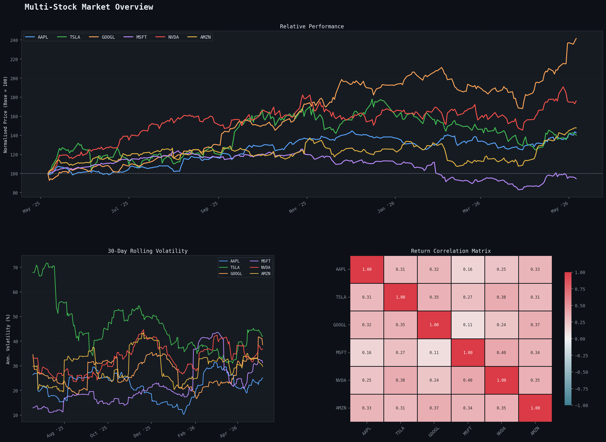
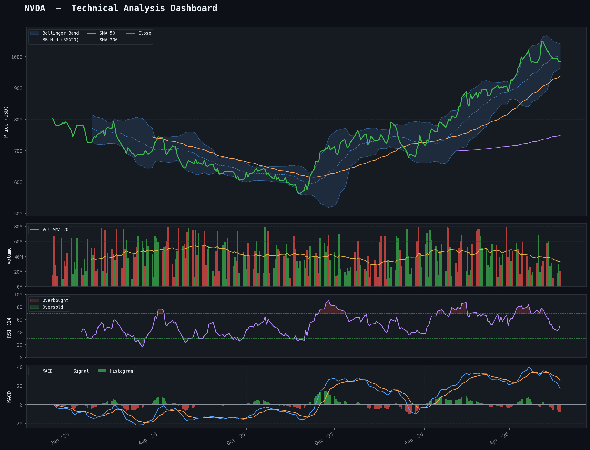

# 📈 Stock Market Analysis Dashboard

A modular, production-grade Python dashboard for analysing stocks using
**Pandas**, **Matplotlib**, and **Seaborn**.

---

## 🚀 Features
- Real-time stock data fetching using yFinance  
- Technical indicators: SMA, EMA, RSI, MACD, Bollinger Bands  
- Returns and volatility analysis  
- Multi-stock comparison dashboard  
- Automatic chart generation and saving  
- Modular architecture for scalability and extensibility  

---

## 🛠 Tech Stack
- Python  
- Pandas, NumPy  
- Matplotlib, Seaborn  
- yFinance  

---

## 🗂️ Project Structure

```
stock_dashboard/
├── main.py           # Entry point – orchestrates everything
├── data_loader.py    # Fetch real data (yfinance) or generate sample data
├── analyzer.py       # All Pandas-based indicator & metric calculations
├── visualizer.py     # All Matplotlib / Seaborn chart rendering
├── requirements.txt  # Dependencies
└── output/           # 📊 Charts are saved here (auto-created)
```

---

## ⚙️ Setup

```bash
# 1. Create a virtual environment (recommended)
python -m venv venv
# Activate environment

# Windows:
venv\Scripts\activate

# Mac/Linux:
source venv/bin/activate

# 2. Install dependencies
pip install -r requirements.txt
```

---

## 🚀 Usage

```bash
# Default run – 6 popular stocks, 1-year period
python main.py

# Custom tickers
python main.py --tickers AAPL TSLA META NFLX

# Change period  (1mo | 3mo | 6mo | 1y | 2y)
python main.py --period 6mo

# Deep-dive on a specific stock
python main.py --focus NVDA --tickers NVDA AMD INTC

# All options combined
python main.py --tickers AAPL GOOGL MSFT NVDA --period 1y --focus NVDA
```

## 📊 Sample Output

  


---

## 📊 Output Charts

After running, three charts are saved in the `output/` folder:

| File | Description |
|------|-------------|
| `{TICKER}_technical.png` | Deep-dive: price + Bollinger Bands, volume, RSI, MACD |
| `multi_stock_overview.png` | Normalised performance + rolling volatility + correlation heatmap |
| `returns_distribution.png` | KDE distribution + box-plot of daily returns |

---

## 📐 Technical Indicators Implemented

| Indicator | Location |
|-----------|----------|
| SMA (20 / 50 / 200) | `analyzer.add_moving_averages` |
| EMA (20) | `analyzer.add_ema` |
| Bollinger Bands | `analyzer.add_bollinger_bands` |
| RSI (14) | `analyzer.add_rsi` |
| MACD (12/26/9) | `analyzer.add_macd` |
| Volume SMA | `analyzer.add_volume_sma` |
| Daily & Cumulative Returns | `analyzer.add_daily_returns / add_cumulative_returns` |
| Rolling Volatility | `analyzer.rolling_volatility` |
| Sharpe Ratio (approx.) | `analyzer.summary_stats` |

---

## 🌐 Live Data vs. Sample Data

- **With internet**: `yfinance` fetches real OHLCV data automatically.
- **Without internet**: The `data_loader` falls back to a deterministic
  geometric Brownian motion generator — great for development & testing.

---

## 🔧 Extending the Project

| Idea | Where to add |
|------|--------------|
| New indicator (e.g. Stochastic) | `analyzer.py` |
| New chart type (e.g. candlestick) | `visualizer.py` |
| Export to HTML/PDF | `main.py` |
| Add a watchlist CSV loader | `data_loader.py` |
| Portfolio weights & P&L | New `portfolio.py` module |

---

## 📦 Dependencies

```
pandas      >= 2.0
matplotlib  >= 3.7
seaborn     >= 0.12
numpy       >= 1.24
yfinance    >= 0.2.28   # optional – sample data used as fallback
tabulate                # optional – pretty console tables
```
---

## 👤 Author

Aditya Singh
